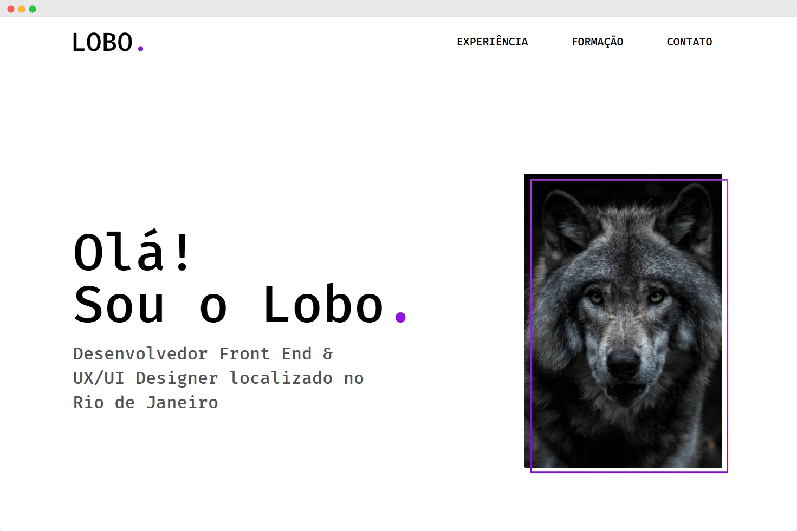

<h1 align="center" style="font-weight: bold;">Lobo portfolio 💻</h1>

<p align="center">
    <a href="#layout">Layout</a> • 
    <a href="#tech">Technologies</a> • 
    <a href="#started">Getting Started</a>
</p>

<p align="center">
    <b>Fictitious portfolio landing page.</b>
</p>

<p align="center">
     <a href="https://luizfbn.github.io/lobo-portfolio/">📱 Visit this Project</a>
</p>

<h2 id="layout">🎨 Layout</h2>

<p align="center">
    
</p>

<h2 id="tech">💻 Technologies</h2>

- HTML
- CSS

<h2 id="started">🚀 Getting started</h2>

<h3>Prerequisites</h3>

- [Git](https://git-scm.com/downloads)

<h3>Cloning</h3>

```bash
git clone https://github.com/luizfbn/lobo-portfolio.git
```

<h3>Starting</h3>

```bash
cd lobo-portfolio
```

Open `index.html` file in your web browser
